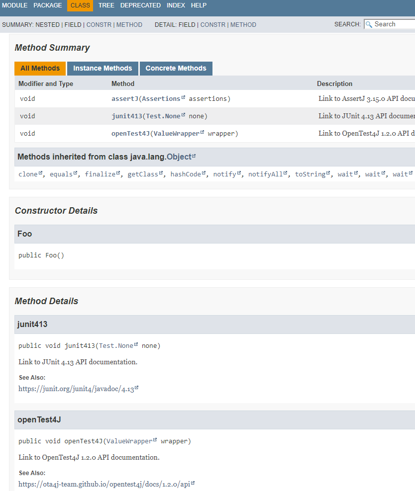

# javadoc-link-non-modular

- https://bugs.openjdk.java.net/browse/JDK-8240169 javadoc fails to link to docs with non-matching modularity

## javadoc 15-ea+18-776

Using javadoc from JDK 15-ea+18-776 yields the wanted links to external API documentation sites.

